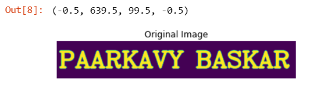
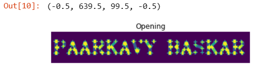

# OPENING AND CLOSING
## AIM:
To implement Opening and Closing using Python and OpenCV.

## SOFTWARE REQUIRED:
1. Anaconda - Python 3.7
2. OpenCV

## ALGORITHM:
### STEP 1:
Import the necessary packages.

### STEP 2:
Create the Text using cv2.putText.

### STEP 3:
Create the structuring element.

### STEP 4:
Use Opening operation.

### STEP 5:
Use Closing Operation.

### STEP 6:
Print the output and end the program. 

## PROGRAM:
```
NAME : Paarkavy B
REG.NO:212221230072
```

``` 
# Import the necessary packages

import numpy as np
import matplotlib.pyplot as plt
import cv2

# Create the Text using cv2.putText

text_image = np.zeros((100,640),dtype = 'uint8')
font = cv2.FONT_HERSHEY_SIMPLEX = 3
cv2.putText(text_image,"PAARKAVY BASKAR",(5,70),font,2,(255),5,cv2.LINE_AA)
plt.title("Original Image")
plt.imshow(text_image)
plt.axis('off')

# Create the structuring element

kernel = cv2.getStructuringElement(cv2.MORPH_CROSS,(11,11))

# Use Opening operation

opening_image = cv2.morphologyEx(text_image,cv2.MORPH_OPEN,kernel)
plt.title("Opening")
plt.imshow(opening_image)
plt.axis('off')

# Use Closing Operation

closing_image = cv2.morphologyEx(text_image,cv2.MORPH_CLOSE,kernel)
plt.title("Closing")
plt.imshow(closing_image)
plt.axis('off')
```

## OUTPUT:
### Display the input Image


### Display the result of Opening


### Display the result of Closing


## RESULT:
Thus the Opening and Closing operation is used in the image using python and OpenCV.